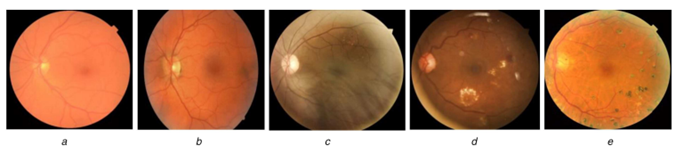

# Performance Comparison of Molecular Data in Diabetic Retinopathy Identification

## 1. Motivation and Overview

Diabetes mellitus (DM) is a global health concern, with a rising prevalence worldwide. This research focuses on diabetic retinopathy (DR), a severe condition leading to blindness. The project aims to leverage advancements in molecular data analysis tools for more effective DR detection. The primary goal is to identify the most reliable molecular data methods for diagnosing DR.

_Figure 1: Images arranged in increasing severity levels of DR (a) No DR, (b) Mild NPDR, (c) Moderate NPDR, (d) Severe NPDR, (e) PDR_

The research addresses an information gap, intending to contribute to improved medical diagnostics and therapy. By exploring diverse molecular data sources, we aim to enhance patient outcomes and medical procedures.

## 1.2 Aims and Objectives

The research project aims to utilize machine learning methods to compare different molecular data sets for DR identification. Key objectives include:

1. **Examine Molecular Data Sets:**

   - Investigate the utility of gene expression patterns, protein biomarkers, and epigenetic markers in detecting DR.

2. **Compare Machine Learning Methods:**

   - Assess and compare the performance of machine learning methods (e.g., support vector machines, random forests, deep neural networks) in identifying DR using diverse molecular data.

3. **Data Analysis and Interpretation:**
   - Analyze molecular mechanisms and pathways associated with diabetic retinopathy to gain valuable insights.

## 1.3 Research Scope

The research will focus on gathering and preparing various molecular datasets related to diabetic retinopathy, including gene expression profiles and protein markers. Machine learning methods will be employed to evaluate their effectiveness in detecting DR. Ethical considerations will be taken into account, and the study will adhere to a specific timeframe. The ultimate goal is to identify potential biomarkers for DR detection and propose the use of machine learning-based diagnostic tools in real-world medical settings.

## Collaborators

- [Banula Lakwindu](https://github.com/banulalakwindu)
- [Fathima Ashfa](https://github.com/ashfa11)

## 2. Comparative Analysis of Molecular Data Types

### 2.1 DNA Methylation Data

**Dataset:** GEO Accession Number - GSE140842

- _About:_ Genome-wide methylation profiles of circulating cell-free DNA from 70 Chinese patients with type 2 diabetes mellitus, including 35 patients with DR and 35 matched controls.

### 2.2 Total RNA and Small RNA

**Dataset:** GEO Accession Number: GSE160310

- _About:_ Transcriptomic data from human post-mortem retinal samples collected from 80 patients diagnosed with various stages of diabetic retinopathy. Analyzed using RNA-Seq.

## 3. Notebooks and Datasets

Include all notebooks, Python codes, datasets, output images, and documentation for each dataset. This section provides a comprehensive overview of the steps taken in the project.

## 4. Steps Document

For a detailed account of the steps taken in each code, including feature selection using multiple algorithms and their results, please refer to the [Steps Document](steps_document.md).
